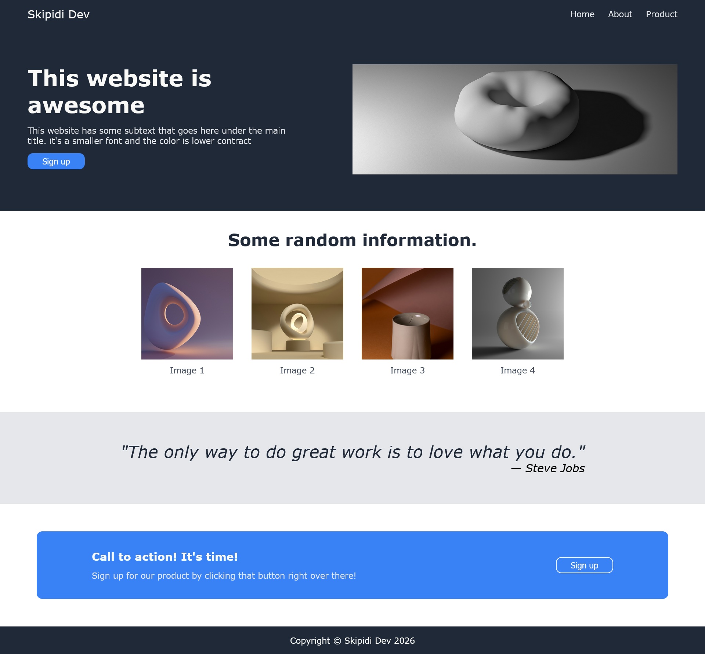

# Landing Page

A responsive landing page built as part of [The Odin Project](https://www.theodinproject.com/) Foundations course.

## Preview

## About

This project focuses on building a landing page from a provided design using HTML and CSS. The goal is to practice layout techniques, particularly Flexbox, while recreating a professional looking page structure.

## What I Learned

- Structuring a full page layout with semantic HTML
- Using Flexbox for alignment and spacing
- Working with CSS custom properties and reusable utility classes
- Organizing CSS with a clear table of contents and section comments
- Using `object-fit` for responsive image handling

## Built With

- HTML
- CSS (Flexbox)

## Live Demo

[View Live Demo](https://skipididev.github.io/landing-page/) 

## Acknowledgments

- Design provided by [The Odin Project](https://www.theodinproject.com/)
- Images from [Unsplash](https://unsplash.com/) 